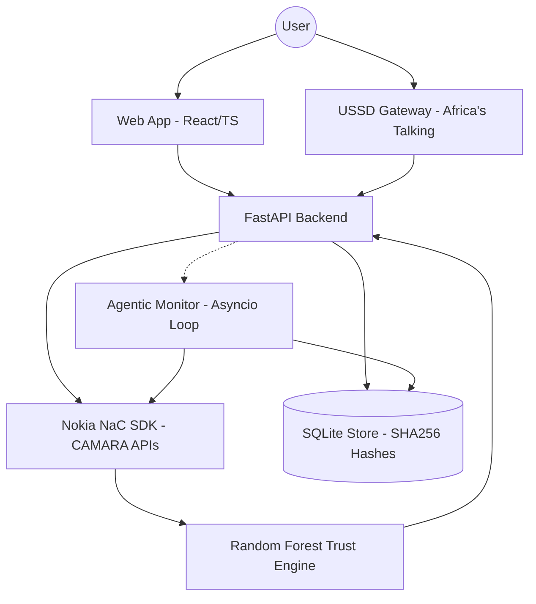

# Technical Architecture: VID (Virtual ID)

## 1. System Architecture Overview
VID is a privacy-first, decentralized digital identity system built for the Pan-African context. It leverages the **GSMA CAMARA APIs** and a machine-learning-based **Trust Engine** to verify identities without storing Personally Identifiable Information (PII).

The system follows a "Yes/No Oracle" pattern: it asks the network operators (via Nokia NaC) questions about the user's SIM and KYC status and receives boolean or scored signals, never raw data.

### Architecture Diagram


---

## 2. Backend Structure (FastAPI)
The backend is structured into modular services, each handling a specific layer of the identity stack.

- **`app/api/routes.py`**: Central router handling enrollment, verification, and USSD callbacks.
- **`app/services/camara_service.py`**: Integration with Nokia NaC SDK. Orchestrates calls to 5 CAMARA APIs (SIM Swap, Number Verification, KYC Match, Location, Device Status).
- **`app/services/trust_engine.py`**: The core ML component. Uses a Random Forest model to transform network signals into a weighted Trust Score (0-100).
- **`app/services/agentic_monitor.py`**: Background autonomous agent that periodically re-verifies active VIDs against fraud triggers.
- **`app/services/certificate_service.py`**: Generates unique VID IDs and QR codes.
- **`app/services/store.py`**: Persistence layer using SQLite. Implements SHA-256 hashing for phone numbers to ensure zero PII storage.

---

## 3. CAMARA API Integration
VID utilizes five critical CAMARA APIs to build a "Proof of Possession" and "Proof of Person":

1.  **SIM Swap**: Detects if the SIM card was recently changed (proxy for account takeover).
2.  **Number Verification**: Confirms the user has possession of the MSISDN via the network data plane.
3.  **KYC Match**: Compares user-provided details (Name, Address, Birthdate) against the MNO's verified records.
4.  **Location Verification**: Ensures the user is physically where they claim to be (geofencing).
5.  **Device Status**: Checks if the device is roaming or has abnormal status.

The `camara_service.py` uses `asyncio.gather` to fetch these signals in parallel, ensuring a fast enrollment experience (< 3s).

---

## 4. Random Forest Trust Engine
The Trust Engine (`trust_engine.py`) is the brain of VID. It uses a **Random Forest Classifier** trained on 9 specific features:

- **Primary SIM Signals**: SIM Swap, KYC Match, Location Match, Device Status.
- **Secondary SIM Signals**: Aggregated signals from linked numbers.
- **Meta Signals**: ID Document provided, Biometric passed, Multi-SIM diversity.

**Scoring Weights:**
- Primary SIM KYC: 35%
- SIM Swap Status: 25%
- Location Match: 15%
- Secondary SIMs: 15% (Bonus for multi-SIM consistency)
- Biometric: 10%

---

## 5. Agentic Monitoring Layer
To meet the "Agentic Bonus" requirement, VID implements a background monitoring loop (`agentic_monitor.py`).
- **Function**: Polls the CAMARA SIM Swap API for every active VID holder every 5 minutes.
- **Trigger**: If a SIM Swap is detected, the agent autonomously flags the VID as "SUSPICIOUS" or "REVOKED" in the store.
- **Impact**: This ensures that a stolen identity is invalidated immediately, even if the user is unaware of the breach.

---

## 6. Persistent Identity System (store.py)
VID implements **Privacy by Design**:
- **No Names**: Names are never stored in the database. They are only printed on the ephemeral certificate.
- **Hashed Identifiers**: Phone numbers are stored as `SHA-256(phone_number + salt)`.
- **Stateless Certificates**: The backend only stores the `certificate_hash` and `vid_id`. Verification works by re-calculating the hash.

---

## 7. USSD Layer
For rural and feature phone users, VID provides a stateful USSD interface via Africa's Talking.
- **Service Code**: `*384*57911#` (Sandbox)
- **Flow**: A session-based state machine (`ussd_service.py`) guides users through language selection, detail entry, and enrollment.
- **Parity**: The USSD flow triggers the same CAMARA logic and Trust Engine as the web app, returning a 12-digit VID code via SMS/Screen.

---

## 8. API Reference (Key Endpoints)

### `POST /api/v1/enroll`
Main enrollment flow.
- **Body**: `EnrollRequest` (Name, Birthdate, PhoneNumbers, Consent, Location).
- **Process**: Parallel CAMARA fetch -> Trust Scoring -> Cert Generation -> Store Hash.

### `GET /api/v1/verify/{vid_id}`
Third-party verification.
- **Returns**: `VerifyResponse` (Valid, Nationality, Trust Grade, Score).
- **Privacy**: Does NOT return the holder's name or phone number.

### `POST /api/v1/ussd`
Callback for Africa's Talking gateway.

---

## 9. Certificate Data Model
```json
{
  "vid_id": "VID-NG-2026-F92EA257",
  "holder_name": "Redemption Jonathan",
  "country": {
    "iso": "NG",
    "name": "Nigeria",
    "vid_label": "Virtual NIN"
  },
  "trust_score": {
    "score": 94,
    "grade": "HIGH",
    "explanation": "Strong KYC match across 2 SIM cards..."
  },
  "issued_at": "2026-05-08T10:00:00Z",
  "expires_at": "2027-05-08T10:00:00Z"
}
```

---

## 10. Country Config System
VID is Pan-African. The `country_config.py` maps phone prefixes to country identities:
- **NG (+234)**: Virtual NIN
- **KE (+254)**: Virtual Huduma Namba
- **GH (+233)**: Virtual Ghana Card
- **ZA (+27)**: Virtual SA ID
- **ET (+251)**: Virtual Fayda
