# User Guide: Getting Started with VID

Welcome to VID (Virtual ID). This guide will walk you through enrolling, managing, and verifying your digital identity.

---

## 1. Enrollment (Web Application)

### Step 1: Landing Page
Navigate to the VID home page. Click **"Get Started"** to begin your journey.

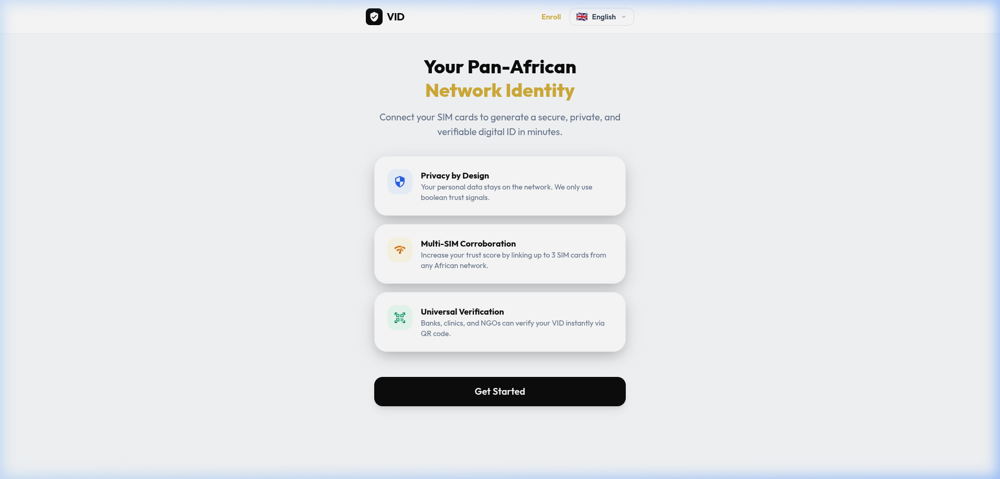

### Step 2: Personal Details
Enter your name, birthdate, and physical address. VID uses these details to match against your Mobile Network Operator's (MNO) KYC records.

### Step 3: Identity Verification
Select your primary country and enter your existing National ID number (if available).

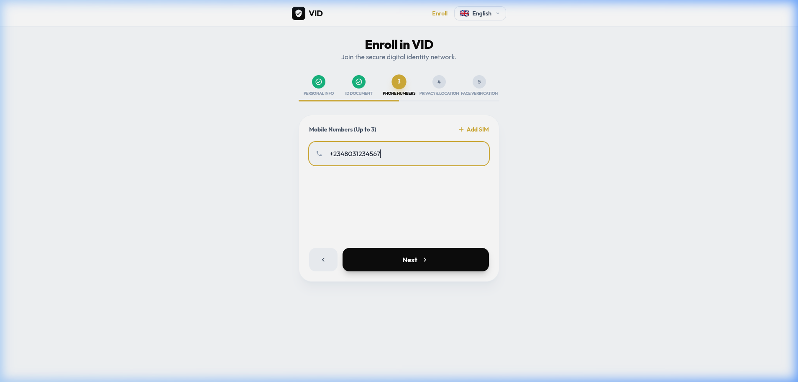

### Step 4: Multi-SIM Bonding
Link your active SIM cards. We recommend adding at least two SIM cards to achieve a "High" trust grade.

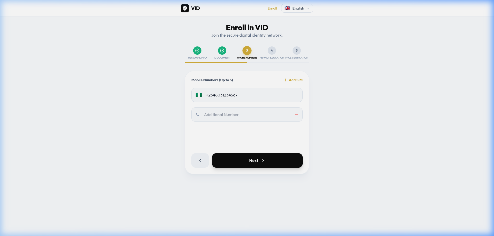

### Step 5: Privacy Consent & Biometric
Review the privacy terms. VID never stores your personal data. You may be asked to perform a quick face capture to verify you are a live person.

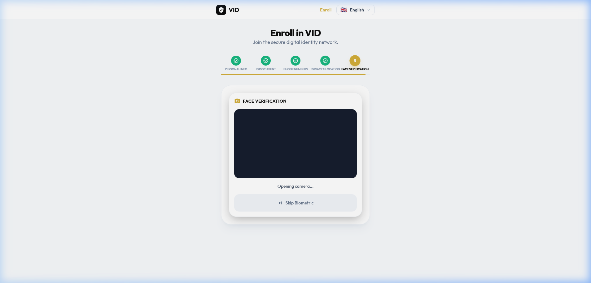

---

## 2. Understanding Your Trust Score
After submission, VID calls the CAMARA APIs via Nokia NaC. You will see a loading state while we verify your network signals.

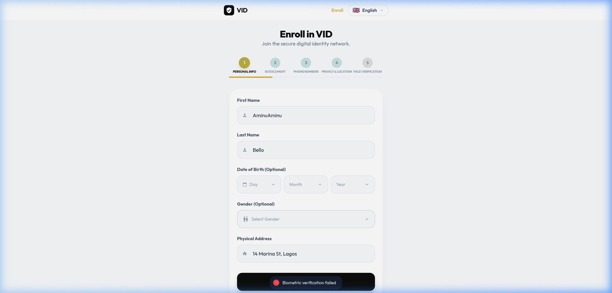

Once verified, your **Trust Score** will be displayed. This score represents the confidence level in your digital identity.

---

## 3. Your VID Certificate
Your certificate contains your unique VID ID and a secure QR code. You can save this as a PDF or show it on your screen for verification.

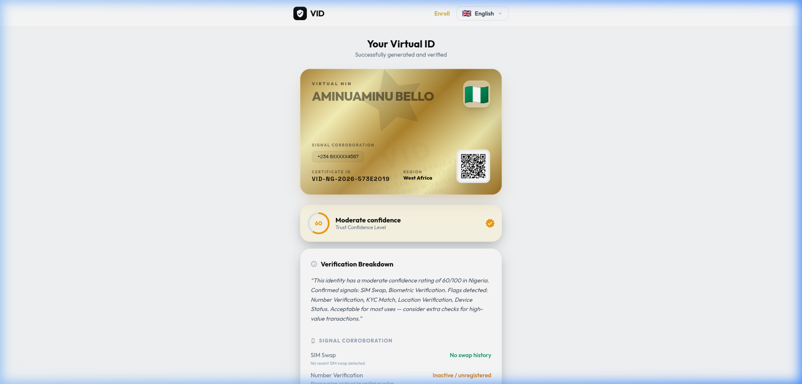

---

## 4. Verification for Third Parties
When a bank or government agency scans your QR code, they are taken to a verification page. They will see your trust grade and nationality, but **not** your personal details.

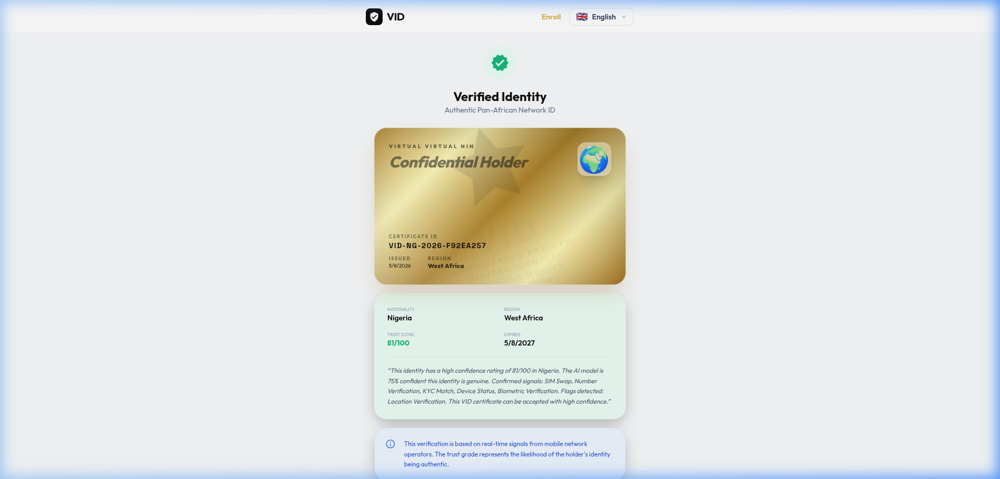

---

## 5. Accessibility & Localization
VID is built for all Africans. You can switch the interface language at any time using the switcher in the navigation bar.

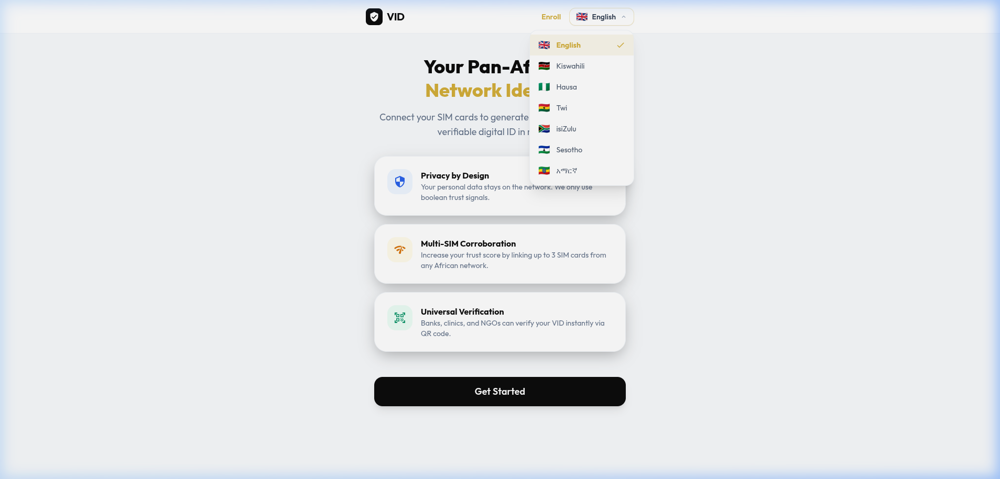

### Mobile Experience
VID is fully responsive and works perfectly on any mobile browser.

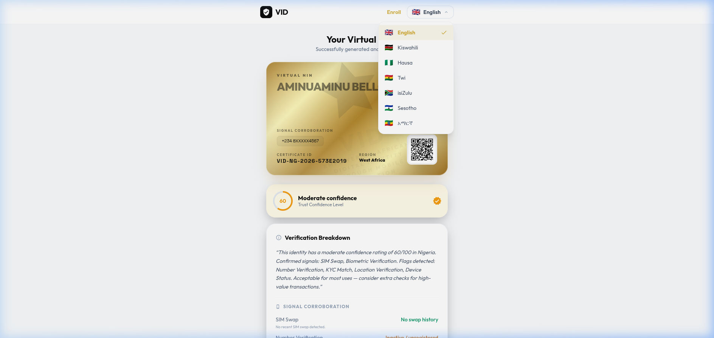

---

## 6. USSD Enrollment (Feature Phones)
If you don't have a smartphone, you can enroll by dialing **`*384*57911#`** on any mobile device.

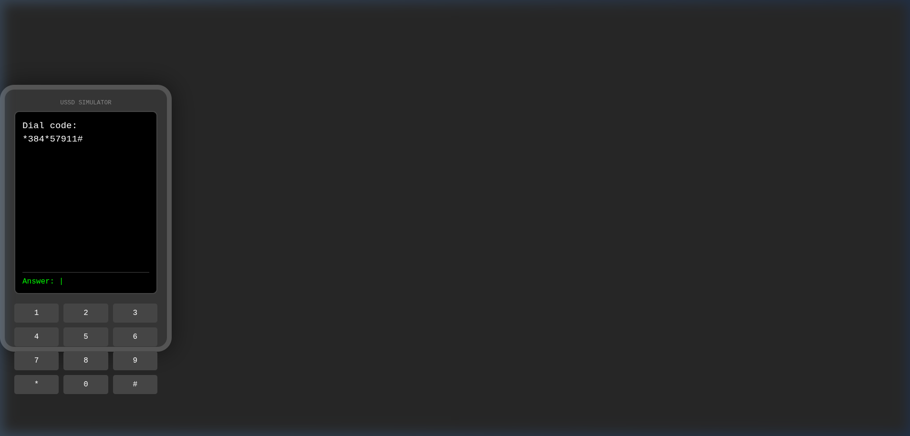
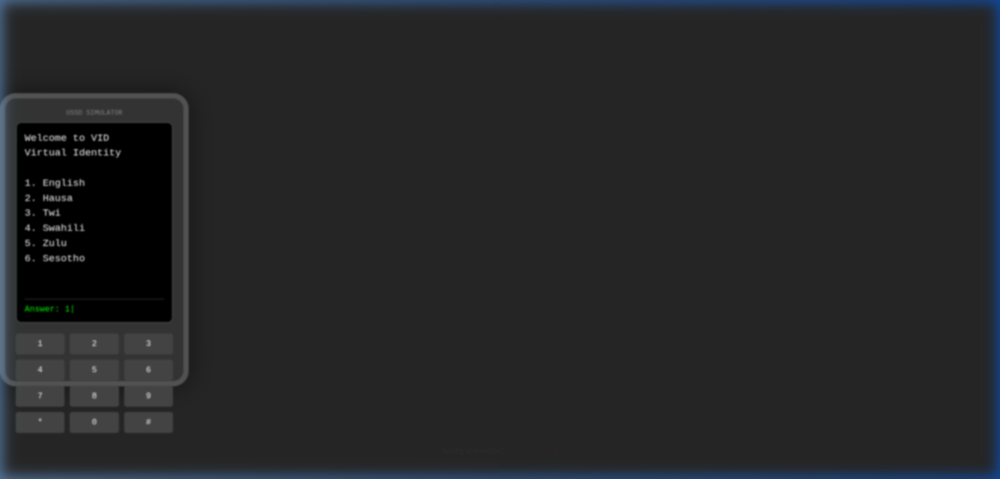
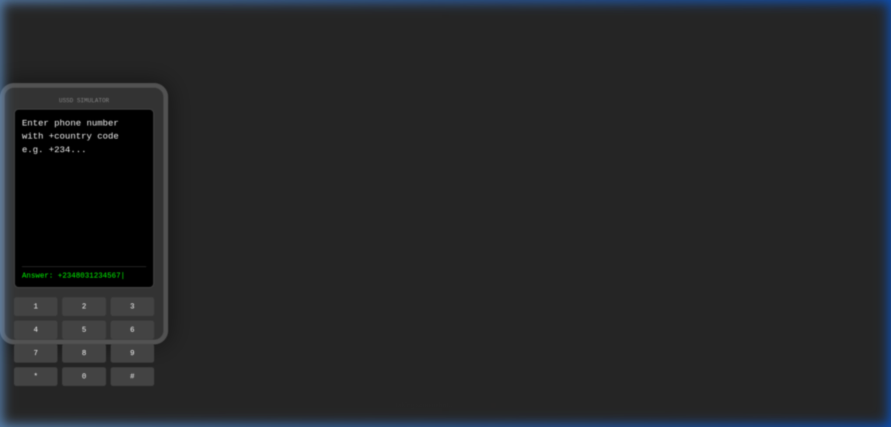
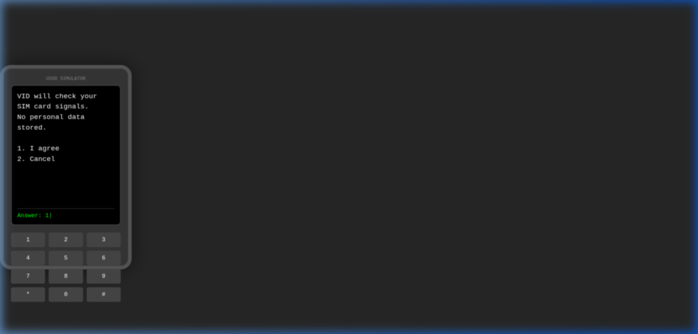
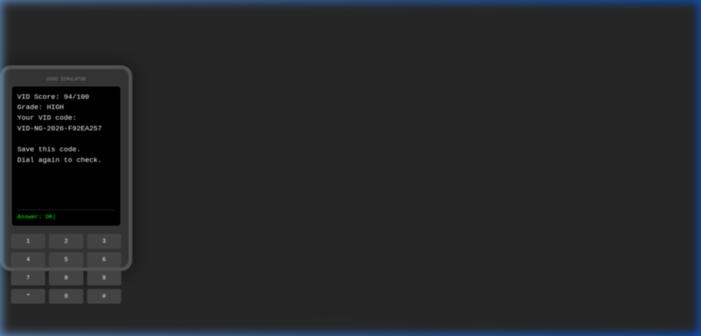
