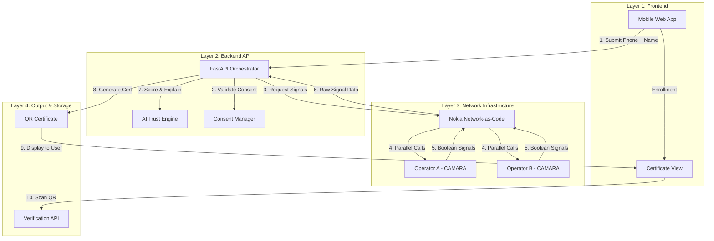

# VID — Architecture Guide 🏗️

The VID (Virtual ID) system is built on a modular 4-layer architecture designed for continental scale, privacy, and real-time network integration.

---

## 📐 System Overview

VID bridges the gap between traditional identity documents and the mobile network infrastructure. It leverages **Nokia Network-as-Code (NaC)** to orchestrate calls to **CAMARA APIs** across multiple mobile operators.

---

## 🛠️ Layer-by-Layer Breakdown

### Layer 1: Frontend (React / TypeScript)
The user-facing interface designed for mobile accessibility.
- **Enrollment**: Capture of phone numbers and explicit user consent.
- **Trust Dashboard**: Visual breakdown of network signals (SIM stability, location, etc.).
- **Digital Certificate**: A verifiable QR-coded identity document.

### Layer 2: Backend API (Python / FastAPI)
The logic engine that coordinates the entire verification flow.
- **FastAPI**: Provides high-performance, asynchronous endpoints.
- **Trust Engine**: Converts raw boolean network signals into a 0–100 score.
- **Mock Service**: A deterministic simulation layer that allows development without live network credentials.

### Layer 3: Network APIs (Nokia Network-as-Code)
The core infrastructure that communicates directly with mobile network operators (MNOs).
- **SIM Swap**: Checks for recent fraud patterns.
- **KYC Match**: Verifies subscriber names against operator records.
- **Location Verify**: Confirms device presence in the declared country.

### Layer 4: Output & Storage
The final verifiable product of the system.
- **QR Certificate**: A signed, verifiable token containing the trust score and signals.
- **Verification API**: Allows third parties (banks, clinics) to scan the QR and verify the identity in real-time.

---

## 🛡️ Key Architectural Principles
1. **Privacy by Design**: Raw subscriber data (like IMSI or precise coordinates) never leaves the network. VID only receives boolean results.
2. **Asynchronous Orchestration**: Backend calls multiple network APIs in parallel to ensure sub-2-second response times.
3. **Multi-SIM Corroboration**: The architecture supports multiple phone numbers per user to cross-check identity across different networks (e.g., MTN and Airtel).

---
> *Architected for a unified digital Africa.*
